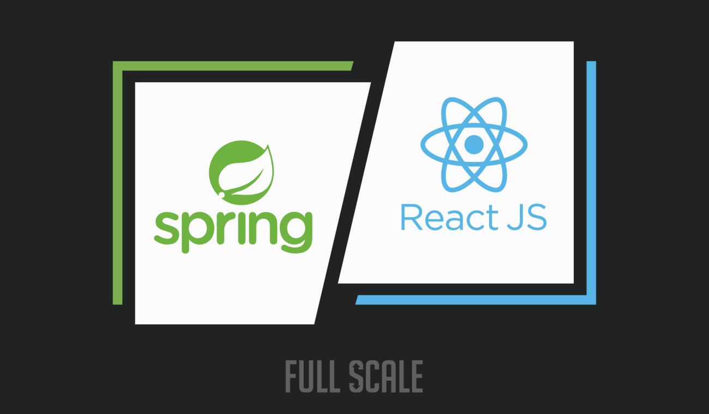

# Employee Management System :office:

Welcome to the "Employee Management System" repository! This project demonstrates my journey as a junior full-stack developer, combining the power of Java, Spring Boot, React, and PostgreSQL to build a robust employee management solution. :computer:

## :star2: Features

- Designed and implemented a RESTful API for managing employee records with CRUD (Create, Read, Update, Delete) operations.
- Developed a simple React-based frontend with Material-UI components.
- Employed Java SE 17 and JDK 17, showcasing coding proficiency and adherence to modern Java syntax.
- Leveraged Spring Boot 3.1.3 for efficient and rapid backend development.
- Utilized Hibernate and Spring Data JPA for seamless interaction with the PostgreSQL database.
- Implemented exception handling for error management.
- Incorporated unit testing with JUnit and Mockito to ensure code reliability and maintainability.

## :clipboard: Project Structure

- **Frontend**:
  - `CustomAppBar.js`: Customized navigation bar for a polished user experience.
  - `EditEmployeeModal.js`: A modal component for editing employee details.
  - `Employee.js`: Component for displaying employee details.
  - `EmployeeForm.js`: Form component for adding and updating employees.
  - `EmployeeList.js`: Component for listing employees.

- **Backend**:
  - `EmployeeController.java`: REST API endpoints for managing employee data.
  - `EmployeeService.java`: Business logic for employee management.
  - `EmployeeRepository.java`: Data access layer for PostgreSQL database interactions.
  - Exception classes (`EmployeeNotFoundException.java`, `InvalidEmployeeDataException.java`) for error handling.

- **Testing**:
  - `EmployeeRepositoryTest.java`: Unit tests for the EmployeeRepository.
  - `EmployeeServiceTest.java`: Unit tests for the EmployeeService.
  - `EmployeeTest.java`: Unit tests for the Employee class.

## :rocket: Getting Started

To run this project locally, follow these steps:

1. Clone this repository to your local machine.
2. Configure the PostgreSQL database connection in the `application.properties` file.
3. Ensure you have the following software installed:
   - Java SE 17
   - Node.js 18.17.1
   - Apache Maven
4. Navigate to the `frontend` directory and install frontend dependencies using `npm install`.
5. Start the Spring Boot backend by running `mvn spring-boot:run` from the project root directory.
6. Start the React frontend by running `npm start` from the `frontend` directory.

## :link: API Endpoints

- **GET** `/api/v1/employees`: Retrieve a list of all employees.
- **POST** `/api/v1/employees`: Create a new employee. (Request Body: `NewEmployeeRequest`)
- **DELETE** `/api/v1/employees/{id}`: Delete an employee by ID.
- **PUT** `/api/v1/employees/{id}`: Update an employee by ID. (Request Body: `UpdateEmployeeRequest`)

## :mortar_board: Lessons Learned

In the course of developing the Employee Management System, I've gained valuable experience and insights into various technologies and best practices. Here are some key takeaways:

- **RESTful API Design**: I've learned how to design and implement RESTful APIs, including structuring endpoints and handling HTTP methods.

- **Frontend Development with React**: Building the user-friendly React-based frontend has improved my skills in creating responsive and interactive web interfaces.

- **Database Integration**: Leveraging Hibernate, Spring Data JPA, and PostgreSQL, I've gained proficiency in integrating databases with Java applications.

- **Exception Handling**: Implementing robust error handling mechanisms has taught me the importance of graceful failure and user-friendly error messages.

- **Unit Testing with JUnit and Mockito**: Writing unit tests using JUnit and Mockito has enhanced my ability to ensure code quality and reliability.

- **Continuous Learning**: This project reinforced the importance of staying updated with the latest technologies and practices in the fast-paced world of software development.

## :bulb: Areas for Improvement

While I'm proud of the progress made with this project, I also acknowledge areas that could benefit from further attention and improvement:

- **Documentation**: Enhancing project documentation, including code comments, API documentation, and a comprehensive README, can make it more accessible to other developers.

- **User Interface Design**: Continuously improving the user interface and user experience (UI/UX) can enhance the application's appeal to end-users.

- **Test Coverage**: Expanding test coverage to include more edge cases and scenarios can further increase code reliability.

- **Performance Optimization**: Identifying and addressing performance bottlenecks, especially with larger datasets, can improve system efficiency.

- **Security**: Strengthening security measures to protect against common vulnerabilities is essential for any production application.

These insights reflect my commitment to continuous learning and growth as a software developer. I welcome feedback and contributions to help make this project even better.

## :camera_flash: Screenshots

<table align="center">
  <tr>
    <td align="center">Employee Management System in Action</td>
  </tr>
  <tr>
    <td align="center"></td>
  </tr>
</table>

<table align="center">
  <tr>
    <td align="center">Editing React Component - employee.js in Visual Studio Code</td>
  </tr>
  <tr>
    <td align="center"></td>
  </tr>
</table>

<table align="center">
  <tr>
    <td align="center">pgAdmin4 - Viewing Employee Table and SQL Commands</td>
  </tr>
  <tr>
    <td align="center"></td>
  </tr>
</table>

<table align="center">
  <tr>
    <td align="center">EmployeeController - RESTful API Endpoints</td>
  </tr>
  <tr>
    <td align="center"></td>
  </tr>
</table>

<table align="center">
  <tr>
    <td align="center">EmployeeServiceTest with Mockito and JUnit - Unit Testing and Code Coverage</td>
  </tr>
  <tr>
    <td align="center"></td>
  </tr>
</table>
